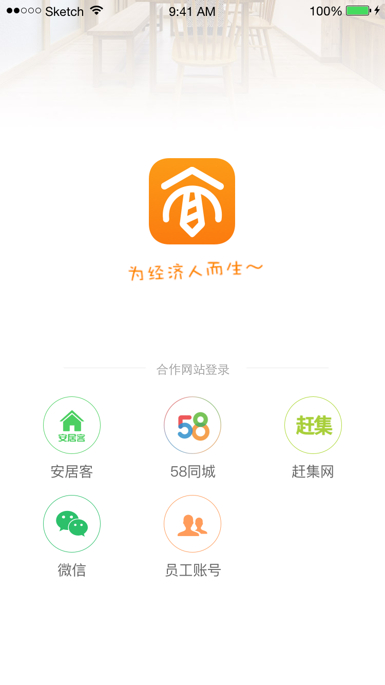
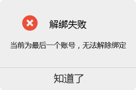
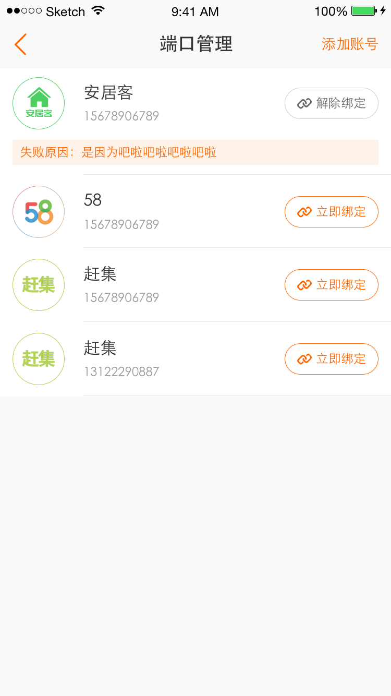
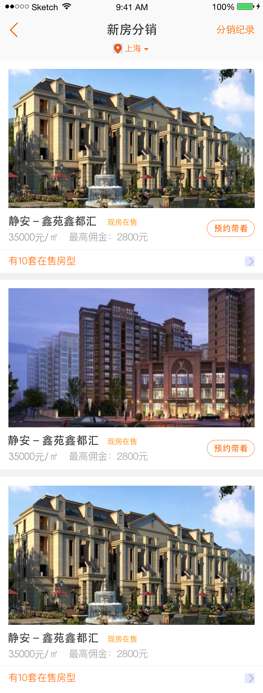
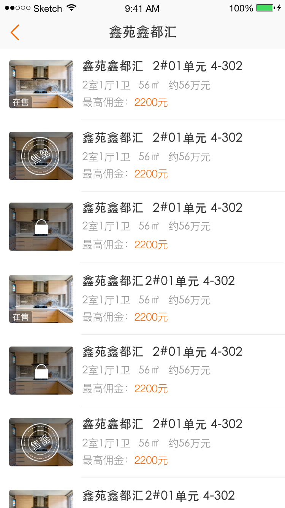
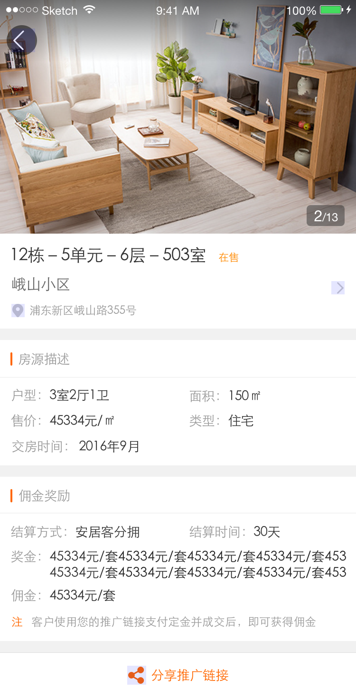

​                                                                                                                                           **Confidential**：（绝密）

​                                                                                                                                                                          **安居客**

********

| **项目名称：** | **集客家APP**      |
| --------- | --------------- |
| **项目编号：** | **CRM20161208** |
| **产品经理：** | **丁秀倩**         |
| **版本**    | **A**           |

​                                                                                                                                  **销售运营中心系统支持产品部**

​                                                                                                                                                        **2016年12月08日**

​                                                                                                                                                    **All RightsReserved**

**0 变更记录（Revision History）**

| **序号** | **变更说明** | **变更日期**   | **变更者** |
| ------ | -------- | ---------- | ------- |
| 1      | 产品文档初版定稿 | 2016.12.08 | 丁秀倩     |
| 2      |          |            |         |

### **一、产品背景与目的**

### 二、产品需求

#### 2.1功能性需求

#### 2.2 非功能性需求

### 三、产品方案

#### 3.1 账号体系

集客家账号

1.  用户可通过58、赶集、安居客、微信、员工账号这5种方式登录集客家。
2.  58、赶集、安居客采用H5授权登录的方式；微信采用原生APP授权登录；员工账号直接在APP中输入公司名称、用户名、密码进行登录。
3.  授权成功则跳转到集客家首页；授权失败返回集客家登录页面，页面文案提示“登录失败，请重新登录”   
4.  创建集客家个人账号：账号授权登录时，需判断登录账号是否有对应的集客家个人账号。

- 若存在，系统以原集客家个人账号登录并展示数据；
- 若不存在，该账号登录时系统创建一个对应的集客家个人账号。如授权登录账号为三网账号，则在“端口管理”层面自动绑定该账号；

5. 微信账号与员工账号在未绑定三网端口的情况下，限制使用以下功能：

- 房源采集—独家委托房源的抢房功能

  用户点击【查看联系方式】时，弹窗提示用户“绑定安居客、58、赶集、任一端口，即可开启抢房功能”。点击【绑定端口】跳转至端口管理页；【关闭】关闭弹窗

- 房源群发—房源发布功能

  用户点击单项的【发布】和批量操作中的【发布】时，弹窗提示用户“你还没有绑定任何端口，无法发布房源”。点击【绑定端口】跳转至端口管理页；【关闭】关闭弹窗

#### 3.2 用户登录

##### 3.2.1 员工账号登录

###### 3.2.1.1业务逻辑

1. 员工账号登录调整为二级页面，登录页增加员工账号登录入口
2. 登录规则保持不变

###### 3.2.1.2页面定义

##### 3.2.2 微信登录

###### 3.2.2.1业务逻辑

1. 用户可通过微信账号授权登录至集客家。
2. 微信授权登录的账号需绑定唯一的集客家账号。
3. 用户点击微信按钮打开微信APP确认授权登录
   - 授权失败，返回登录页面，页面toast提示“登录失败，请重试”
   - 授权成功，返回集客家
4. 登录成功后，需判断登录账号是否有绑定集客家账号。

- 有集客家账号：系统以该三体个人账号登录并展示数据
- 无集客家账号：系统自动创建一个对应的集客家账号，并自动绑定微信账号与集客家账号

5. 授权登录成功后，对应的微信账号若为首次登录，必须验证手机号，验证成功，信息同步到个人账号资料中。

6. 用户未安装微信APP，微信按钮灰色不可点击

   ​

###### 

#### 3.3 一网多账号

一网多账号方案需兼容已发布出去的历史app版本。当用户使用老版本时，接口返回的端口信息只返回绑定时间为最早的一个账号。

##### 3.3.1 端口管理

###### 3.3.1.1业务逻辑

- 账号绑定

1. 一个端口账号只能与一个集客家账号建立关联关系，若已绑定的端口账号要做其他绑定，则需走解绑流程
2. 与集客家账号存在关联关系的58、赶集、安居客端口任一账号均可以授权登陆该集客家账号
3. 一网多账号绑定暂不支持搜房网
4. 一个网站最多支持绑定3个账号。

- 账号解绑

1. 当解除绑定关系的账号为最后一个三网账号，且集客家个人账号下未绑定微信或员工账号时，则不允许解绑。

   弹窗提示”解绑失败。当前为最后一个账号，无法解除绑定。”【知道了】关闭弹窗。

   

2. 当解除绑定关系的账号为最后一个三网账号，但集客家个人账号下有绑定微信账号或员工账号时，允许解绑三网账号。弹窗提示用户：“确定解除绑定关系？解绑后，你将无法再使用该账号登录”【确定】解除绑定关系；【取消】关闭弹窗

   

   ​

###### 3.3.1.2页面定义

​                                                                                           端口管理页

1. 页面显示规则

- 新增多账号展示样式。展示字段均保持不变。

2. 操作 

- 点击【添加账号】，底部弹层显示可绑定的账号。

- 用户已绑定了1个搜房账号，添加账号中的搜房按钮灰色不可点击。

- 当一个网站绑定满3个账号时，该网站的添加按钮灰色不可点击。

- 绑定规则与解绑规则保持不变。

- 当页面未绑定任何账号时，显示“还没有绑定任何端口哦

  ​

##### 3.3.2 房源发布与房源下架

1. 新增一网多账号的展示样式

2. 进入选择发布/下架平台页时，新增字段“网站对应的用户id”

3. 提交发布数据至api时需带入网站对应的用户id

4. 用户在房源列表页（包含批量操作）与房源详情页点击发布按钮时，需校验是否有绑定端口，如未绑定任何端口，需弹窗提示“你还没有绑定任何端口，无法发布房源”，点击【关闭】关闭弹窗，【绑定端口】进入端口管理页

   

   ​

5. 用户操作发布/继续发布、下架、重新发布完成后弹窗内容调整如下：

   将“已提交发布（下架/重新发布)，结果请在日志中查看。您选择了 # 条房源，发布至# 个网站” 网站调整为端口。以实际发布的端口数量为计算。例：发布2个网站的3个账号，则显示为3个端口。

   

   ​

   ​

##### 3.3.3 房源日志/已发布网站列表

1. 新增一网多账号的展示样式，api返回网站对应的用户id
2. 包含二手房与租房的相应页面

#### 3.4消息管理

##### 3.4.1消息中心                             

-   内容调整，将“网站”更新为“端口”，以实际发布端口的数量计算。

​       标题：【二手房】房源“发布”进度提醒

​       内容：您“发布”了# 条【】房源至# 个端口。成功#条，失败#条。

​       注：“”内分为发布、下架、重新上架三种操作方式。【】内分为二手房、租房

 

##### 3.4.2 消息push

-   内容调整，将“网站”更新为“端口”，以实际发布端口的数量计算。

​     内容：您“发布”了# 条【】房源至# 个端口。成功#条，失败#条。

​    注：“”内分为发布、下架、重新上架三种操作方式。【】内分为二手房、租房

#### 3.5 新房分销

##### 3.5.1 分销房源

###### 3.5.1.1业务逻辑

1. 分销房源是指具体到楼盘下明确的房子

   1）分佣方式：分销楼盘分销房源是通过用户使用经纪人分享的推广链接支付房源定金并后

2. 当楼盘不允许分销时，则该楼盘不允许预约报备。

3. 分销房源的订单是在用户支付定金后生成。

###### 3.5.1.2页面定义

​                                                                                           分销列表页

1. 页面显示规则

- 楼盘列表在原来分销楼盘的基础上新增分销房源的内容。

- 当页面同时有分销楼盘和分销房源时，优先显示分销房源的数据。

- 分销房源不允许分销时，【预约报备】按钮隐藏。

2. 基本信息

- 字段包括：板块、楼盘名称、售价、最高佣金、楼盘图片、楼盘在售状态、在售房源数量、房源图片

3. 操作 

- 点击分销房源楼盘图片进入楼盘详情页
- 点击分销房源图片进入房源详情页。点击房源图片更多按钮进入房源列表页。

​                                                                                         楼盘详情页

1. 基本信息

- 字段包括：楼盘图片、楼盘名称、地址、楼盘类型、楼盘在售状态、售价、佣金、奖金、结算时间、结算方式、项目卖点、在售房源套数

- 字段为空时，显示暂无（售价为空时，显示售价待定）；楼盘图片为空时，显示默认图片

2. 操作

 合作咨询：点击可拨打楼盘驻场电话。电话为空时，按钮灰色不可点击。

预约带看：点击进入报备申请页。流程同分销楼盘。分销房源不允许分销时，【预约报备】按钮灰色不可点击

​                                                                                    

1. 页面显示规则

- 一页显示20条房源数据。手势上推加载后一页。
- 显示顺序根据房源在售状态为在售—>锁定—>售罄
- 房源名称显示为：楼栋号—单元号—层数—户数
- 售价为空时，显示售价待定
- 佣金为空时，显示佣金待定

2. 基本信息

- 标题栏：楼盘名称

​      字段包括：楼栋号—单元号—层数—户数、户型、面积、售价、最高佣金、房源图片、房源在售状态（包含在售、锁定、售罄）

- 房源图片

​      无图。显示默认图片。

​      有图。显示首张图片。

3. 操作 

点击分销房源内容进入房源详情页

                                                                                             

1. 基本信息

- 字段包括：房源图片、楼栋号—单元号—层数—户数、楼盘名称、楼盘地址、房源在售状态、户型、面积、售价、类型、交房时间、优惠、佣金、奖金、结算时间、结算方式
- 字段为空时，显示暂无（售价为空时显示“售价待定”）；楼盘图片为空时，显示默认图片
- 售价默认加“起”

2. 操作

 分享推广链接：可分享至微信好友、微信朋友圈和短信、复制链接

- 点击【分享】，页面底部弹层。

- 用户手机中未安装微信或QQ，则对应的按钮灰色不可点击。
- 房源在售状态为锁定和售罄，分享按钮灰色不可点击

- 微信分享内容包括：

​      标题：区域+楼盘名称

​      内容：楼盘在售状态+类型+售价

​      图片：楼盘第一张图片

​      H5链接：新房对应的H5楼盘页面（楼盘对应的H5链接，由新房通过接口与楼盘展示字段一起提供）集客家需提交用户id至新房接口。

- 短信分享：调用手机自带短信系统，将短信内容带入文本框。

- 短信分享内容如下：

  新房-区域-板块-楼盘名称 售价 。点击：（短链接）查看详情[安居客]

- 复制链接：点击按钮直接将包含集客家用户id的H5分享链接粘贴到手机剪切板，toast提示“复制成功”