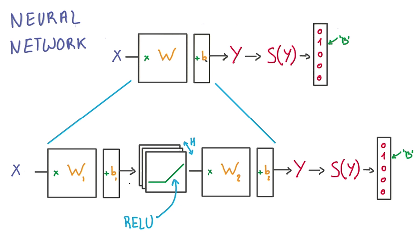
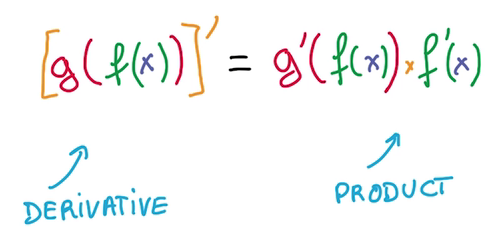
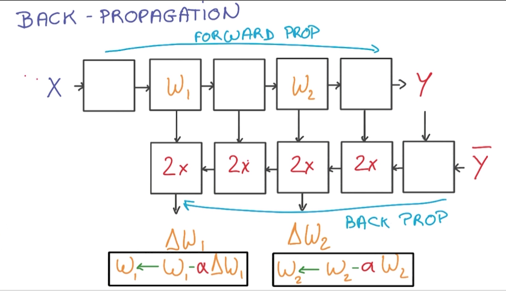

# Neural network
- 用一个RELU作为中介，一个Linear Model的输出作为其输入，其输出作为另一个Linear Model的输入，使其能够解决非线性问题

- 神经网络并不一定要完全像神经元那样工作
- Chain Rule：复合函数求导规律

- Lots of data reuse and easy to implement（a simple data pipeline）
- Back propagation

  
 
  - 计算train_loss时，数据正向流入，计算梯度时，逆向计算
  - 计算梯度需要的内存和计算时间是计算train_loss的两倍
  
- 利用上面的知识，结合lesson1中的SGD，训练一个全连接神经网络：[神经网络实践](neural_practical.md)