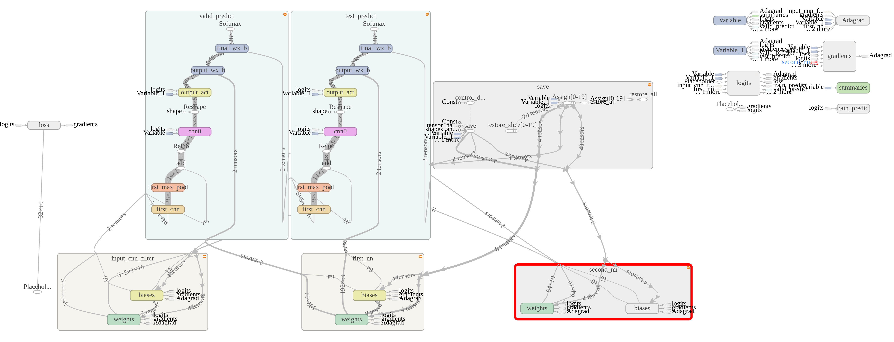
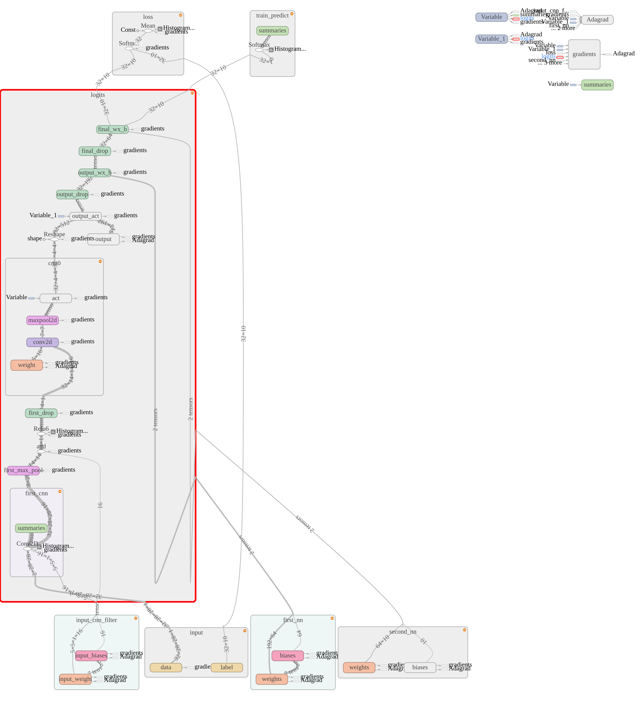

# 初识Tensorboard

官方教程：https://www.tensorflow.org/versions/master/how_tos/graph_viz/index.html

> TensorFlow自带的一个强大的可视化工具

## 功能
这是TensorFlow在MNIST实验数据上得到[Tensorboard结果](https://www.tensorflow.org/tensorboard/index.html#graphs)

- Event: 展示训练过程中的统计数据（最值，均值等）变化情况
- Image: 展示训练过程中记录的图像
- Audio: 展示训练过程中记录的音频
- Histogram: 展示训练过程中记录的数据的分布图
 
## 原理
- 在运行过程中，记录结构化的数据
- 运行一个本地服务器，监听6006端口
- 请求时，分析记录的数据，绘制

## 实现
### 在构建graph的过程中，记录你想要追踪的Tensor

```python
with tf.name_scope('output_act'):
    hidden = tf.nn.relu6(tf.matmul(reshape, output_weights[0]) + output_biases)
    tf.histogram_summary('output_act', hidden)
```

其中，
- histogram_summary用于生成分布图，也可以用scalar_summary记录存数值
- 使用scalar_summary的时候，tag和tensor的shape要一致
- name_scope可以不写，但是当你需要在Graph中体现tensor之间的包含关系时，就要写了，像下面这样：

```python
with tf.name_scope('input_cnn_filter'):
    with tf.name_scope('input_weight'):
        input_weights = tf.Variable(tf.truncated_normal(
            [patch_size, patch_size, num_channels, depth], stddev=0.1), name='input_weight')
        variable_summaries(input_weights, 'input_cnn_filter/input_weight')
    with tf.name_scope('input_biases'):
        input_biases = tf.Variable(tf.zeros([depth]), name='input_biases')
        variable_summaries(input_weights, 'input_cnn_filter/input_biases')
```

- 在Graph中会体现为一个input_cnn_filter，可以点开，里面有weight和biases
- 用summary系列函数记录后，Tensorboard会根据graph中的依赖关系在Graph标签中展示对应的图结构
- 官网封装了一个函数，可以调用来记录很多跟某个Tensor相关的数据：

```python
def variable_summaries(var, name):
    """Attach a lot of summaries to a Tensor."""
    with tf.name_scope('summaries'):
        mean = tf.reduce_mean(var)
        tf.scalar_summary('mean/' + name, mean)
        with tf.name_scope('stddev'):
            stddev = tf.sqrt(tf.reduce_sum(tf.square(var - mean)))
        tf.scalar_summary('sttdev/' + name, stddev)
        tf.scalar_summary('max/' + name, tf.reduce_max(var))
        tf.scalar_summary('min/' + name, tf.reduce_min(var))
        tf.histogram_summary(name, var)
```

- 只有这样记录国max和min的Tensor才会出现在Event里面
- Graph的最后要写一句这个，给session回调

```python
merged = tf.merge_all_summaries()
```

### Session 中调用
- 构造两个writer，分别在train和valid的时候写数据：

```python
train_writer = tf.train.SummaryWriter(summary_dir + '/train',
                                              session.graph)
valid_writer = tf.train.SummaryWriter(summary_dir + '/valid')
```

- 这里的summary_dir存放了运行过程中记录的数据，等下启动服务器要用到
- 构造run_option和run_meta，在每个step运行session时进行设置：

```python
summary, _, l, predictions = 
    session.run([merged, optimizer, loss, train_prediction], options=run_options, feed_dict=feed_dict)
```

- 注意要把merged拿回来，并且设置options
- 在每次训练时，记一次：

```python
train_writer.add_summary(summary, step)
```

- 在每次验证时，记一次：

```python
valid_writer.add_summary(summary, step)
```  

- 达到一定训练次数后，记一次meta做一下标记

```python
train_writer.add_run_metadata(run_metadata, 'step%03d' % step)
```

### 查看可视化结果
- 启动TensorBoard服务器：

```
python安装路径/python TensorFlow安装路径/tensorflow/tensorboard/tensorboard.py --logdir=path/to/log-directory
```
注意这个python必须是安装了TensorFlow的python，tensorboard.py必须制定路径才能被python找到，logdir必须是前面创建两个writer时使用的路径

比如我的是：
```
/home/cwh/anaconda2/envs/tensorflow/bin/python /home/cwh/anaconda2/envs/tensorflow/lib/python2.7/site-packages/tensorflow/tensorboard/tensorboard.py --logdir=~/coding/python/GDLnotes/src/convnet/summary
```

使用python
- 然后在浏览器输入 http://127.0.0.1:6006 就可以访问到tensorboard的结果

## 强迫症踩坑后记
- 之前我的cnn代码里有valid_prediction，所以画出来的graph有两条分支，不太清晰，所以只留了train一个分支

修改前：



修改后：




- 多用with，进行包裹，这样才好看，正如官网说的，你的summary代码决定了你的图结构
- 不是所有的tensor都有必要记录，但是Variable和placeholder最好都用summary记录一下，也是为了好看
- 由于有了gradient的计算，所以与gradient计算相关的都会被拎出来，下次试一下用其他optimizer

我的CNN TensorBoard代码：[cnn_board.py](../../src/convnet/cnn_board.py)


## 参考资料
- [mnist_with_summaries.p](https://github.com/tensorflow/tensorflow/blob/r0.10/tensorflow/examples/tutorials/mnist/mnist_with_summaries.py)
